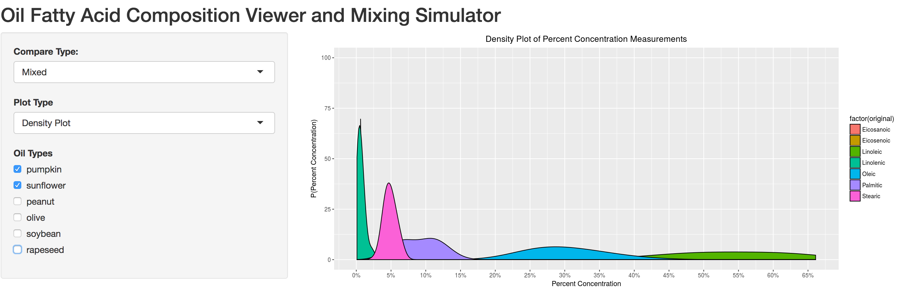

```{r setup, include=FALSE}
knitr::opts_chunk$set(echo = FALSE)
```

## View an oil's fatty acid "fingerprint"
```{r}

```
<br>
* Use density plots to explore the probabilities for percent concentration of each fatty acid type!
<br>
* It looks like pumpkin oil is typically composed of high concentrations of Linoleic (around 50%) and Oleic (around 33%) acid!


## Compare multiple oils at once

```{r}

```
<br>
* Using faceting, multiple oils can be compared at the same time!
<br>
* Pumpkin and sunflower oil have similar compositions
<br>
* Olive oil is very different, however. Olive oil has much more Oleic acid than the two other oils!


## View the likely concentrations with box plots too

```{r cars}

```
<br>
* Since the faceted graphs share the same y-axis, it is easy to look right across to compare the range of fatty acid concentrations
<br>
* Choose which oil to order the x-axis by. In this case, the x-axis is ordered by fatty acid concentrations of pumpkin oil.
<br>
* Quickly see how the rank of highest concentrated fatty acid is Linoleic acid for pumpkin oil versus Oleic acid for olive oil

## Simulate a 1:1 mixing of multiple oils

```{r pressure}

```
<br>
* Combine all the data points from multiple oils to see the likely compositions if one mixed the oils equally with each other
<br>
* A mix between sunflower and pumpkin oil has a wide range of possible values for Oleic and Linoleic acid, while Stearic and Linolenic acid concentrations would not vary by much.
